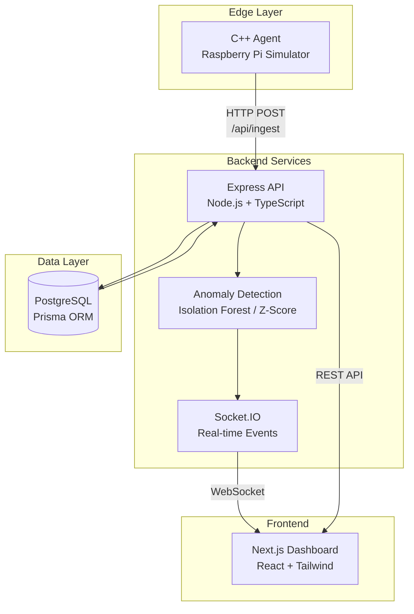
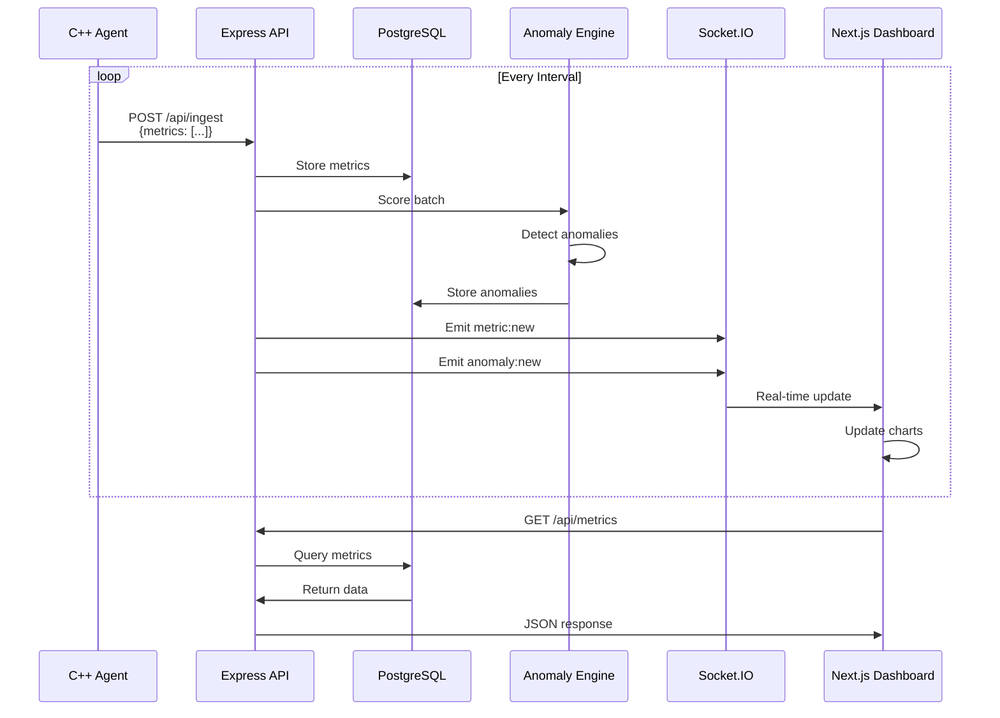

# Real-Time C++ Edge Agent for IoT Metrics


A production-ready, multi-service system for collecting IoT device metrics, performing real-time anomaly detection, and visualizing data through a modern web dashboard.

## 🎯 Key Features

<table>
<tr>
<td width="50%">

### ⚡ Real-Time Processing
- **Edge Analytics**: Local z-score detection in C++
- **FFT Analysis**: Frequency-domain vibration analysis
- **Live Updates**: Socket.IO powered real-time dashboard
- **Low Latency**: Sub-second anomaly detection

</td>
<td width="50%">

### 🔍 Anomaly Detection
- **Dual Engines**: Isolation Forest & Z-Score
- **Configurable**: Switch engines via environment variable
- **Multi-Metric**: Temperature, vibration, humidity, voltage
- **Per-Device**: Separate models per device

</td>
</tr>
<tr>
<td width="50%">

### 📊 Visualization
- **Interactive Charts**: Time-series with Recharts
- **Device Management**: View and filter devices
- **Anomaly Alerts**: Visual indicators
- **Time Ranges**: 15m, 1h, 24h, 7d views

</td>
<td width="50%">

### 🚀 Production Ready
- **Docker Compose**: One-command deployment
- **Health Checks**: Built-in monitoring
- **CI/CD**: GitHub Actions workflow
- **Comprehensive Tests**: Unit & integration tests

</td>
</tr>
</table>

## Architecture

### System Overview



### Data Flow Diagram



### Deployment Architecture

```mermaid
graph LR
    subgraph "Docker Compose"
        subgraph "Network: iot-network"
            DB[(PostgreSQL:5432)]
            BACKEND[Backend:8080]
            DASHBOARD[Dashboard:3000]
        end
    end
    
    subgraph "Host Machine"
        AGENT[C++ Agent<br/>make run-agent]
    end
    
    AGENT -.->|HTTP| BACKEND
    BACKEND <--> DB
    BACKEND <-->|Socket.IO| DASHBOARD
    BACKEND -->|REST API| DASHBOARD
    
    style DB fill:#336791
    style BACKEND fill:#68a063
    style DASHBOARD fill:#000000
    style AGENT fill:#00599c
```



### Data Flow

1. **C++ Agent** simulates IoT devices, generating metrics (temperature, vibration, humidity, voltage) with configurable intervals
2. **Backend** receives metrics via REST API, stores in PostgreSQL, runs anomaly detection (Isolation Forest or Z-Score)
3. **Anomalies** are detected in real-time and broadcast via Socket.IO
4. **Dashboard** visualizes metrics and anomalies in real-time using React and Recharts

## EdgeFlow Mode — MQTT + Python ML (Isolation Forest)

EdgeFlow extends the system with an MQTT ingest path, a C/C++ sensor client, and an optional Python ML microservice for Isolation Forest scoring — while keeping the original HTTP + z-score path intact.

### TL;DR Quickstart

```bash
# 0) From repo root
cp backend/.env.example backend/.env
cp ml-service/.env.example ml-service/.env

# 1) Bring up the full stack with MQTT + Python ML enabled
MQTT_ENABLE=true PY_ML_ENABLE=true docker compose up --build

# 2) (New) Run the C MQTT agent
make run-agent-c   # publishes to sensors/<deviceId>/metrics via mosquitto

# 3) Visit the app
# Dashboard: http://your-dashboard-url:3000
# Backend health: http://your-backend-url:8080/api/health
# Python ML health: http://your-backend-url:8000/health
```

**Want the original pipeline only?** Run without toggles:

```bash
docker compose up --build        # HTTP ingest + Node z-score only
make run-agent                   # existing C++ HTTP agent
```

### What's Included

- **Mosquitto broker** (Docker, port 1883)
- **C MQTT client** (`agent-c/`) with configurable publish interval & spike probability
- **Backend MQTT bridge** (`backend/src/mqtt/bridge.ts`) that:
  - Subscribes to `sensors/+/metrics`
  - Upserts devices, writes metrics
  - Scores anomalies via Python Isolation Forest when enabled, else falls back to rolling z-score
  - Emits `metric:new` & `anomaly:new` over Socket.IO
- **Python ML service** (`ml-service/`) with FastAPI + scikit-learn (IsolationForest, warm-start capable)
- **Dashboard additions**:
  - `/map` route with MapLibre device markers (last-seen + anomaly badge)
  - Optional Plotly charts for high-density series (toggleable in UI)

### Environment Flags

Add these to `backend/.env` (see `.env.example`):

```env
# MQTT
MQTT_ENABLE=true
MQTT_BROKER_URL=mqtt://mosquitto:1883

# Python ML Service
PY_ML_ENABLE=true
PY_ML_URL=http://ml-service:8000

# Existing
DATABASE_URL=postgresql://postgres:postgres@db:5432/iot
PORT=8080
ANOMALY_ENGINE=zscore   # still used on HTTP path or as fallback
ALLOW_AUTO_DEVICE=true
SOCKET_IO_CORS=*
```

`ml-service/.env`:

```env
ISOFOREST_WINDOW=512
ISOFOREST_CONTAM=0.03
ISOFOREST_THRESHOLD=0.65
WARM_START=true
```

### MQTT Topics & Payloads

- **Publish topic**: `sensors/<deviceId>/metrics`
- **Payload** (single point per message):

```json
{
  "ts": "2025-11-11T03:21:05.123Z",
  "temperature_c": 22.3,
  "vibration_g": 0.034,
  "humidity_pct": 44.7,
  "voltage_v": 4.91,
  "lat": 37.335,
  "lng": -121.881
}
```

Location fields are optional; when present, the dashboard map will show markers and last-seen state.

### Make Targets

```bash
make run-agent      # build & run original C++ HTTP agent
make run-agent-c    # build & run new C MQTT client
make dev-mqtt       # compose with MQTT + Python ML enabled
make bench-ingest   # optional: publish N messages/sec (if included)
```

### Architecture (EdgeFlow path)

```
C/C++ Agent (MQTT)
    └─> Mosquitto Broker (1883)
            └─> Backend MQTT Bridge (subscribe sensors/+/metrics)
                    ├─> PostgreSQL (metrics, anomalies)
                    ├─> Python ML Service (IsolationForest, /score-batch)  [optional]
                    └─> Socket.IO → Dashboard (live charts, map, tables)
```

**(Original path remains)**

```
C++ HTTP Agent ──> Express /api/ingest ──> DB ──> Z-score ──> Socket.IO → Dashboard
```

### API — Python ML Service

- **POST /score-batch**

Request:

```json
{
  "deviceId": "uuid",
  "points": [
    { "ts": "2025-11-11T03:21:05.123Z", "temperature_c": 22.3, "vibration_g": 0.034, "humidity_pct": 44.7, "voltage_v": 4.91 }
  ]
}
```

Response:

```json
{
  "scores": [
    { "index": 0, "score": 0.82, "isAnomaly": true }
  ]
}
```

- **GET /health** → `{ "ok": true }`

### Dashboard Additions

- **`/map`** — MapLibre device markers (color-tinted by last anomaly state)
- Device detail page can toggle chart engine: **Recharts ⇄ Plotly** (for big series)
- Real-time updates via Socket.IO remain unchanged

### Troubleshooting

- **Backend can't see Mosquitto**

Ensure `MQTT_BROKER_URL=mqtt://mosquitto:1883` (service name on the Docker network), not localhost.

- **No anomalies showing**

- Confirm `PY_ML_ENABLE=true` and ML service health at `:8000/health`.
- If disabled, backend falls back to z-score — lower the z-score threshold or increase spike probability on the agent.

- **Map is empty**

Send `lat`/`lng` at least once per device, or set a default location in the DB.

- **High-rate publishing causes lag**

Use Plotly mode for charts; consider batching in the bridge before scoring.

### Backward Compatibility

- Running without `MQTT_ENABLE` and `PY_ML_ENABLE` reproduces the original behavior.
- All existing commands, routes, and tests continue to work.

---

## 🚀 Quick Start (1 Minute)

### Prerequisites

- Docker & Docker Compose
- Node.js 20+ (for local development)
- CMake 3.10+ and libcurl (for C++ HTTP agent)
- libmosquitto-dev (for C MQTT agent - EdgeFlow mode)
  - Ubuntu/Debian: `sudo apt-get install libmosquitto-dev`
  - macOS: `brew install mosquitto`
- Make

### Start Services

```bash
# Clone and navigate to project
cd edge-iot-anomaly-agent

# Start backend, database, and dashboard
cd infra && docker compose up --build
```

This will:
- Start PostgreSQL on port 5432
- Run Prisma migrations automatically
- Seed demo devices
- Start backend API on port 8080
- Start dashboard on port 3000

### Run Agent

In a new terminal, choose one of these options:

**HTTP Path (Original):**
```bash
# Standard agent with local analytics (z-score)
make run-agent

# Vibration sensor module with FFT-based anomaly detection
make run-vibration
```

**MQTT Path (EdgeFlow Mode):**
```bash
# C MQTT client (requires libmosquitto-dev)
make run-agent-c
```

The agent will start streaming metrics. Open the dashboard in your browser to see updates in real-time.

### Example Agent Output

```bash
$ make run-agent

IoT Edge Agent - Starting...
Configuration:
  Device ID: sim-device-001
  API URL: http://your-backend-url:8080
  Interval: 1000 ms
  Anomaly Probability: 0.05
  Local Analytics: Enabled (window=200, z-threshold=3.0)
Starting metric collection loop...
[2024-01-01T12:00:00.123Z] Temp: 22.45°C (z=0.85), Vib: 0.021g (z=0.42), Hum: 45.12%, Volt: 4.91V
[2024-01-01T12:00:01.234Z] Temp: 22.67°C (z=1.12), Vib: 0.019g (z=0.38), Hum: 45.34%, Volt: 4.90V
[ANOMALY] Temperature spike detected!
[2024-01-01T12:00:02.345Z] Temp: 30.52°C (z=4.23), Vib: 0.022g (z=0.45), Hum: 45.21%, Volt: 4.91V [LOCAL ANOMALY TEMP]
```

### Example Vibration Sensor Output

```bash
$ make run-vibration

IoT Vibration Sensor Module - Starting...
Features: FFT-based anomaly detection + Local analytics
Configuration:
  Device ID: sim-device-001
  API URL: http://your-backend-url:8080
  Interval: 1000 ms
Starting vibration monitoring loop...
FFT window: 256 samples, Local analytics window: 200 samples
[2024-01-01T12:00:00.123Z] Vib: 0.0214g, Z-score: 1.23, Mean: 0.0201, StdDev: 0.0012
  [FFT] Dominant freq: 30.00 Hz, Total power: 45.23
[FFT ANOMALY] High-frequency resonance detected!
[2024-01-01T12:00:01.234Z] Vib: 0.5234g, Z-score: 4.56, Mean: 0.0201, StdDev: 0.0012 [LOCAL ANOMALY VIB]
  [FFT] Dominant freq: 150.00 Hz, Total power: 234.56
```

### Example Docker Compose Startup

```bash
$ cd infra && docker compose up --build

[+] Building 45.2s
[+] Running 4/4
 ✔ Container iot-postgres    Started
 ✔ Container iot-backend      Started  
 ✔ Container iot-dashboard    Started

iot-backend  | Waiting for database...
iot-backend  | Generated Prisma Client
iot-backend  | Migrations applied
iot-backend  | Seeding database...
iot-backend  | Server started successfully!
iot-backend  |    API: http://localhost:8080 (internal)
iot-backend  |    Engine: isoforest

iot-dashboard | ▲ Next.js 14.2.33
iot-dashboard | - Local:        http://localhost:3000 (internal)
iot-dashboard | ✓ Ready in 2.3s
```

### Example API Response

```bash
$ curl http://your-backend-url:8080/api/health

{
  "status": "ok",
  "timestamp": "2024-01-01T12:00:00.000Z",
  "database": {
    "connected": true,
    "stats": {
      "devices": 3,
      "metrics": 1523,
      "anomalies": 12
    }
  },
  "anomalyEngine": "isoforest"
}
```

## 🛠️ Technology Stack

```
┌─────────────────────────────────────────────────────────────┐
│                    Technology Stack                         │
├─────────────────────────────────────────────────────────────┤
│                                                             │
│  Edge Layer          Backend Layer         Frontend Layer   │
│  ┌──────────┐       ┌──────────────┐     ┌─────────────┐ │
│  │   C++17  │       │  Node.js 20  │     │  Next.js 14 │ │
│  │  CMake   │       │  TypeScript  │     │   React 18  │ │
│  │ libcurl  │       │   Express    │     │   Tailwind  │ │
│  │   FFT    │       │   Prisma     │     │   Recharts  │ │
│  │ Z-Score  │       │  Socket.IO   │     │   Plotly    │ │
│  │   C/MQTT │       │   MQTT Bridge│     │  MapLibre   │ │
│  └──────────┘       └──────────────┘     └─────────────┘ │
│                                                             │
│  ML Service         Data Layer          Infrastructure      │
│  ┌──────────┐       ┌──────────┐       ┌──────────────┐   │
│  │  Python  │       │PostgreSQL│       │ Docker Compose│   │
│  │FastAPI   │       │   15    │       │  Mosquitto    │   │
│  │scikit-   │       └──────────┘       │  GitHub CI/CD│   │
│  │learn     │                           └──────────────┘   │
│  └──────────┘                                               │
│                                                             │
└─────────────────────────────────────────────────────────────┘
```

## 📁 Project Structure

```
edge-iot-anomaly-agent/
├── agent-cpp/          # C++17 IoT simulator (HTTP)
│   ├── CMakeLists.txt
│   ├── include/
│   │   ├── local_analytics.hpp  # Edge-side z-score analytics
│   │   ├── fft_analyzer.hpp     # FFT-based vibration analysis
│   │   ├── http_client.hpp
│   │   └── config.hpp
│   ├── src/
│   │   ├── main.cpp              # Main agent (with local analytics)
│   │   ├── vibration_sensor.cpp  # Vibration sensor (with FFT)
│   │   ├── http_client.cpp
│   │   └── config.cpp
│   └── config/
│       └── agent.json
├── agent-c/            # C MQTT client (EdgeFlow mode)
│   ├── CMakeLists.txt
│   ├── include/
│   │   └── mqtt_client.h
│   ├── src/
│   │   ├── main.c
│   │   └── mqtt_client.c
│   └── config/
│       └── agent.ini
├── backend/            # Node.js + Express + Prisma
│   ├── src/
│   │   ├── index.ts
│   │   ├── routes/
│   │   ├── mqtt/                 # MQTT bridge (EdgeFlow)
│   │   │   └── bridge.ts
│   │   ├── anomaly/
│   │   │   └── pyservice.ts     # Python ML client
│   │   ├── realtime.ts
│   │   └── anomaly/
│   ├── prisma/
│   │   └── schema.prisma
│   ├── scripts/
│   └── Dockerfile
├── ml-service/         # Python ML microservice (EdgeFlow)
│   ├── app/
│   │   └── main.py              # FastAPI + Isolation Forest
│   ├── requirements.txt
│   └── Dockerfile
├── dashboard/          # Next.js 14+ App Router
│   ├── app/
│   │   ├── map/                 # Map page (EdgeFlow)
│   │   └── devices/[id]/        # Device detail with Plotly toggle
│   ├── components/
│   │   ├── MapCard.tsx          # MapLibre map component
│   │   └── PlotlyChart.tsx      # Plotly chart component
│   └── Dockerfile
├── infra/              # Docker Compose
│   ├── docker-compose.yml
│   └── mosquitto/
│       └── mosquitto.conf       # MQTT broker config
├── Makefile
├── README.md
└── .env.example
```

## Configuration

### Environment Variables

Copy `.env.example` to `.env` and customize:

```bash
# Database
DATABASE_URL=postgresql://postgres:postgres@db:5432/iot

# Backend
BACKEND_PORT=8080
ANOMALY_ENGINE=isoforest  # or 'zscore'
ANOMALY_WINDOW_SIZE=512
ALLOW_AUTO_DEVICE=true

# Dashboard
NEXT_PUBLIC_BACKEND_URL=http://your-backend-url:8080
```

### Agent Configuration

Edit `agent-cpp/config/agent.json`:

```json
{
  "device_id": "sim-device-001",
  "api_base_url": "http://your-backend-url:8080",
  "interval_ms": 1000,
  "jitter_ms": 100,
  "anomaly_probability": 0.05,
  "metrics": {
    "temperature": true,
    "vibration": true,
    "humidity": true,
    "voltage": true
  }
}
```

Or override via CLI:

```bash
./agent --device_id=my-device --api_base_url=http://your-backend-url:8080 --interval_ms=2000
```

## API Documentation

### Ingest Metrics

```bash
POST /api/ingest
Content-Type: application/json

{
  "deviceId": "sim-device-001",
  "metrics": [
    {
      "ts": "2024-01-01T12:00:00Z",
      "temperature_c": 22.5,
      "vibration_g": 0.02,
      "humidity_pct": 45.0,
      "voltage_v": 4.9
    }
  ]
}
```

### List Devices

```bash
GET /api/devices
```

### Query Metrics

```bash
GET /api/metrics?deviceId=sim-device-001&from=2024-01-01T00:00:00Z&to=2024-01-01T23:59:59Z&limit=100
```

### Query Anomalies

```bash
GET /api/anomalies?deviceId=sim-device-001&from=2024-01-01T00:00:00Z&type=isoforest
```

### Health Check

```bash
GET /api/health
```

## Edge-Side Analytics (C++)

The C++ agents include lightweight local analytics for edge-side anomaly detection:

### Local Analytics Module (`local_analytics.hpp`)

- **Running Statistics**: Maintains rolling window (default: 200 samples) for mean and standard deviation
- **Z-Score Detection**: Flags anomalies when |z-score| > threshold (default: 3.0)
- **Per-Metric Tracking**: Separate statistics for temperature, vibration, humidity, and voltage
- **Low Overhead**: O(1) update time, minimal memory footprint

**Usage in Main Agent:**
The standard agent (`make run-agent`) uses local analytics to detect anomalies before sending to backend:
- Real-time z-score calculation for each metric
- Local anomaly flags displayed in console output
- Reduces backend processing load

### FFT-Based Vibration Analyzer (`fft_analyzer.hpp`)

- **Frequency Domain Analysis**: Cooley-Tukey FFT implementation for vibration signals
- **Anomaly Detection**: Identifies unusual frequency patterns, resonances, and power spikes
- **Dominant Frequency**: Tracks primary vibration frequency (e.g., motor RPM)
- **Power Analysis**: Detects excessive vibration energy

**Usage in Vibration Sensor:**
The vibration sensor module (`make run-vibration`) combines:
- FFT analysis for frequency-domain anomalies (high-frequency resonances, unusual harmonics)
- Local analytics for amplitude-based anomalies (z-score on vibration magnitude)
- Specialized vibration signal generation with harmonics and anomalies

**Example Output:**
```bash
[2024-01-01T12:00:00.123Z] Vib: 0.0214g, Z-score: 1.23, Mean: 0.0201, StdDev: 0.0012
  [FFT] Dominant freq: 30.00 Hz, Total power: 45.23
[FFT ANOMALY] High-frequency resonance detected!
[2024-01-01T12:00:01.234Z] Vib: 0.5234g, Z-score: 4.56, Mean: 0.0201, StdDev: 0.0012 [LOCAL ANOMALY VIB]
```

## Backend Anomaly Detection

The backend supports two anomaly detection engines:

### Isolation Forest (`isoforest`)

- Simplified isolation forest implementation using median absolute deviation (MAD)
- Trains on a sliding window of recent metrics (default: 512 points)
- Features: temperature_c, vibration_g, humidity_pct, voltage_v
- Flags anomalies based on score percentile threshold
- Note: For production, consider using a full isolation forest library

### Z-Score (`zscore`)

- Rolling window mean and standard deviation per metric per device
- Default window: 200 points
- Flags anomalies when |z-score| > 3

### Switching Engines

Set environment variable:

```bash
ANOMALY_ENGINE=zscore  # or 'isoforest'
```

The backend will automatically use the selected engine without code changes.

## Real-Time Updates

The dashboard connects to Socket.IO for real-time updates:

- `metric:new` - New metric received
- `anomaly:new` - Anomaly detected
- `device:update` - Device status changed

## Development

### Backend

```bash
cd backend
npm install
npm run dev          # Start with hot reload
npm test             # Run tests
npm run lint         # Lint code
npx prisma studio    # Open Prisma Studio
```

### Dashboard

```bash
cd dashboard
npm install
npm run dev          # Start dev server
npm test             # Run tests
npm run lint         # Lint code
```

**New Pages (EdgeFlow):**
- `/map` - Interactive device map with MapLibre markers (shows devices with lat/lng)
- `/devices/[id]` - Device detail page with Plotly/Recharts toggle for high-density data

### Agent (HTTP Path)

```bash
cd agent-cpp
mkdir -p build && cd build
cmake ..
make

# Run main agent (with local analytics)
./agent

# Run vibration sensor module (with FFT analysis)
./vibration_sensor
```

**Building Both Executables:**
The CMake build system creates two executables:
- `agent`: Main IoT agent with local z-score analytics
- `vibration_sensor`: Specialized vibration sensor with FFT-based anomaly detection

### Agent (MQTT Path - EdgeFlow)

```bash
cd agent-c
mkdir -p build && cd build
cmake ..
make

# Run C MQTT client
./agent-c

# Or use CLI flags to override config
./agent-c --device_id=my-device --mqtt=mqtt://localhost:1883 --interval_ms=500
```

**Configuration:**
Edit `agent-c/config/agent.ini` or use CLI flags:
- `--device_id=<id>` - Device identifier
- `--mqtt=<url>` - MQTT broker URL
- `--interval_ms=<ms>` - Publish interval
- `--spike_prob=<0.0-1.0>` - Anomaly injection probability

## Testing

### Backend Tests

```bash
cd backend
npm test
```

Tests include:
- Route handlers (ingest, devices, metrics, anomalies)
- Anomaly detection engines
- Socket.IO event emission

### Dashboard Tests

```bash
cd dashboard
npm test
```

Tests include:
- Component rendering
- API integration
- Socket.IO client

### Integration Test

```bash
# Start services
make dev

# In another terminal, run agent
make run-agent

# Verify metrics appear in dashboard
```

## Troubleshooting

### Database Connection Issues

```bash
# Check if PostgreSQL is running
docker ps | grep postgres

# Check logs
cd infra && docker compose logs db

# Reset database
make down
make db-migrate
make db-seed
```

### Agent Not Connecting

**HTTP Agent:**
- Verify backend is running: `curl http://your-backend-url:8080/api/health`
- Check agent config: `cat agent-cpp/config/agent.json`
- Verify network: agent should reach your backend URL

**MQTT Agent (EdgeFlow):**
- Verify Mosquitto is running: `docker ps | grep mosquitto`
- Check MQTT broker URL: `cat agent-c/config/agent.ini`
- Test MQTT connection: `mosquitto_sub -h localhost -t sensors/+/metrics -v`
- Ensure libmosquitto-dev is installed: `pkg-config --modversion mosquitto`

### No Anomalies Detected

**HTTP Path:**
- Check anomaly engine: `echo $ANOMALY_ENGINE`
- Increase anomaly probability in agent config
- Verify metrics are being ingested: `curl http://your-backend-url:8080/api/metrics?limit=10`

**MQTT Path (EdgeFlow):**
- Verify Python ML service: `curl http://your-backend-url:8000/health`
- Check backend logs for MQTT bridge: `docker logs iot-backend | grep MQTT`
- Verify `PY_ML_ENABLE=true` or check z-score fallback
- Increase spike probability: `./agent-c --spike_prob=0.1`

### Dashboard Not Updating

- Check Socket.IO connection in browser console
- Verify `NEXT_PUBLIC_BACKEND_URL` matches backend URL
- Check backend logs for Socket.IO errors

## CI/CD

GitHub Actions workflow (`.github/workflows/ci.yml`) runs on push:

- Builds backend, dashboard, and agent
- Runs tests
- Validates Prisma schema
- Lints code

## Production Deployment

### Backend

1. Set production environment variables
2. Run migrations: `npx prisma migrate deploy`
3. Build: `npm run build`
4. Start: `npm start`

### Dashboard

1. Set `NEXT_PUBLIC_BACKEND_URL` to production backend URL
2. Build: `npm run build`
3. Start: `npm start`

### Agent

1. Build for target platform (Raspberry Pi ARM)
2. Configure `agent.json` with production backend URL
3. Run as systemd service or container

## License

MIT

## Contributing

1. Fork the repository
2. Create a feature branch
3. Make changes
4. Add tests
5. Submit a pull request

